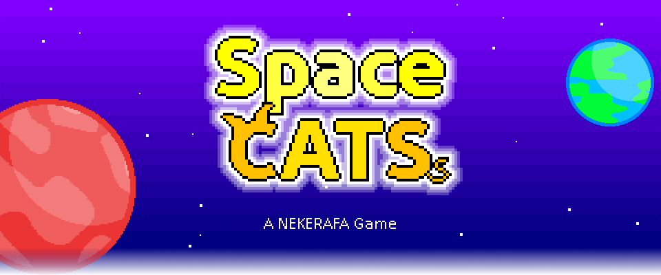
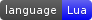

 

Space Cats es un videojuego Shoot'em Up espacial en un universo de fantasías con animales antropomorfos.

Información del proyecto
--------------------------------------------------------------------------------
En cada carpeta se encuentra un archivo README.md que describe información del
contenido de cada carpeta, pero aquí hay un breve resumen de como se organiza
el proyecto.

### Lista To-Do

Está pensado en orden cronológico:
+ Acabar el editor de niveles.
+ (en paralelo) Añadir el soporte con mando.
+ (en paralelo) Redactar la historia principal.
+ Añadir los elementos gráficos necesarios de cada parte de la historia
+ Empezar a implementar la historia principal, expandiendo el editor con lo
necesario para cada nivel.
 + Una vez creados los primeros niveles, empaquetar la siguiente versión.
+ *En revisión*

Versiones
--------------------------------------------------------------------------------

### BETA 0.2 (1.1-demo)
Se ha reorganizado la carpeta de librerías para mantenerlas estáticas.
Se crea e implementa el editor de niveles.

### BETA 0.1 (1.0-demo)
Primera release de Space Cats publicada con las mecánicas acabadas, forma parte
de primera versión demo.

### ALPHAKA 0.9
Se ha limpiado el código y algunos assets para una mejor organización.

### ALPHAKA 0.8
Las mecánicas están acabadas, solo falta pulirlas y pronto maquetaré una demo
jugable.

### ALPHAKA 0.6
Se ha portado el juego de C++ a Löve, ya que me es más fácil programar en este
lenguaje debido a lo muy especializado que estoy con el, por lo que a partir de
ahora se desarrollará en este lenguaje.

### ALPHAKA 0.5
He añadido los archivos base de una prueba de concepto. Esta casi todo
operativo y funcional.
Se necesita actualmente tener instalados SDL2, SDL2_Image y SDL2_tff.

Licencia
--------------------------------------------------------------------------------
> GNU LESSER GENERAL PUBLIC LICENSE 3.0
>
> Version 3, 29 June 2007
>
>Copyright (C) 2007 Free Software Foundation, Inc. <http://fsf.org/>
>
>Everyone is permitted to copy and distribute verbatim copies
>of this license document, but changing it is not allowed.
>
>
>This version of the GNU Lesser General Public License incorporates
>the terms and conditions of version 3 of the GNU General Public
>License, supplemented by the additional permissions listed in LICENSE file.
